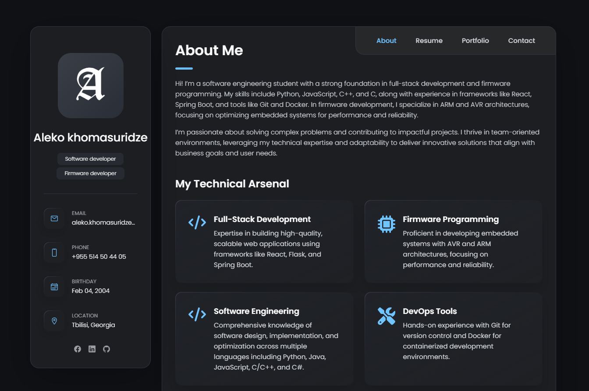

# 🌐 Personal Portfolio Website

A responsive and modern portfolio website built with **HTML, CSS, and JavaScript** to showcase my skills, projects, and experience.

## 🚀 Features
- **Fully responsive** design for desktop and mobile
- **Smooth animations** and interactive UI
- **Project showcase** with links to GitHub
- **Contact section** for inquiries
- **Optimized for SEO** and fast performance

## 📸 Preview
  

## 🔗 Live Demo
[Visit the Portfolio](https://aleko-khomasuridze.github.io/Personal-Portfolio/)

## 🛠️ Technologies Used
- HTML5
- CSS3 (Flexbox & Grid)
- JavaScript (Vanilla JS)

## 📂 Installation & Usage
1. **Clone the repo**  
   ```sh
   git clone https://github.com/aleko-khomasuridze/Personal-Portfolio.git
   ```
2. **Open the `index.html` file** in a browser or use a local server.

## 📬 Contact
For any inquiries, reach out via:  
📧 Email: [aleko.khomasuridze@gmail.com]  
🔗 LinkedIn: [My Profile](https://www.linkedin.com/in/aleko-khomasuridze-61a466225/)  
